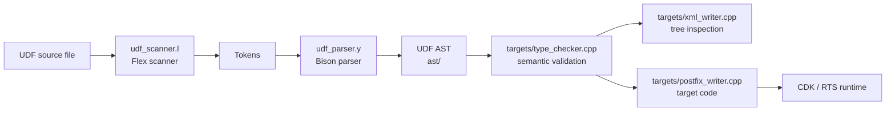
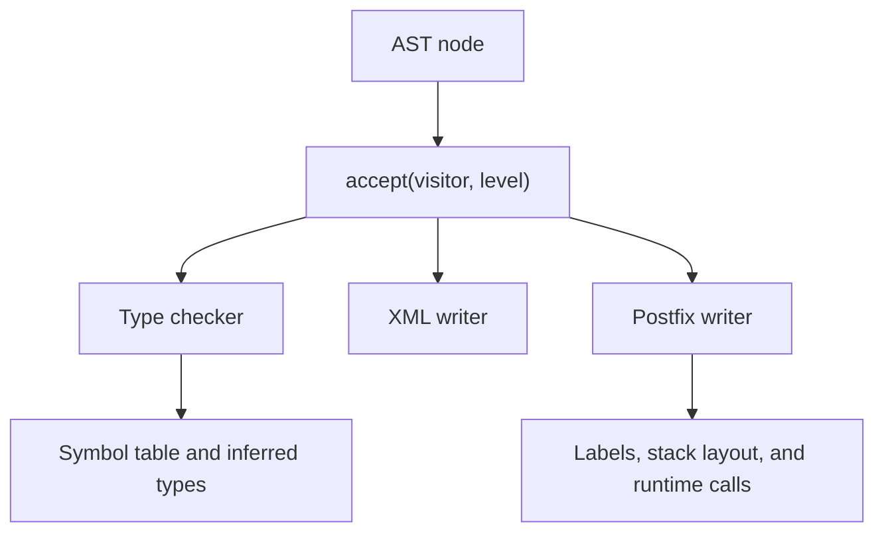
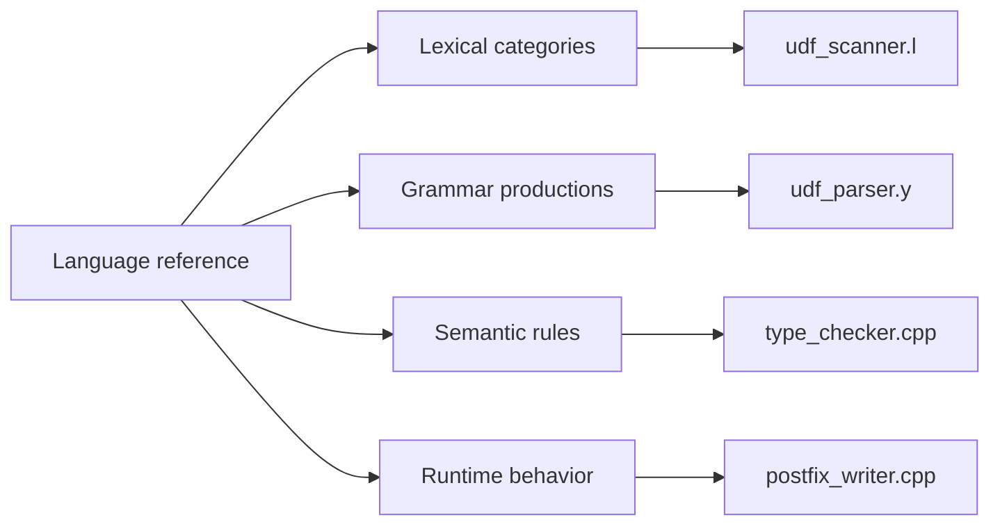

# UDF Compiler Architecture

This document describes the compiler pipeline and the boundary between the UDF
implementation and the course-provided CDK/RTS toolchain.

## Compilation Pipeline

Parsing constructs the UDF-specific AST directly. Semantic analysis validates
and annotates the tree before any backend visitor emits output.

## Visitor Boundary

The node hierarchy should remain a structural representation of the language.
Compiler behavior belongs in visitors, which keeps parsing, semantic analysis,
and target lowering reviewable as separate concerns.

## Component Responsibilities

| Component | Responsibility | Boundary |
| --- | --- | --- |
| `udf_scanner.l` | Lexical rules, reserved words, and token values | Does not build AST structure |
| `udf_parser.y` | Grammar, precedence, and AST construction | Does not perform full semantic validation |
| `ast/` | Concrete language node definitions | Does not own backend logic |
| `targets/type_checker.cpp` | Symbol validation, type inference, and semantic errors | Does not emit target instructions |
| `targets/xml_writer.cpp` | Structural XML output for inspection | Does not decide program validity |
| `targets/postfix_writer.cpp` | Lowering to postfix-oriented target code | Assumes a semantically valid typed tree |
| `factory.cpp` | CDK compiler registration | Keeps UDF integration localized |

## Language-to-Implementation Map

This mapping makes it easier to classify defects: tokenization issues belong
in the scanner, syntactic structure in the parser, language validity in the
type checker, and emitted behavior in the postfix writer.

## Architectural Constraints

- The build assumes the IST CDK and RTS packages configured through `ROOT` in
  the Makefile.
- Authorized course fixtures are not distributed with the repository.
- The compiler targets the UDF course language, not a stable public ABI.
- CI is intentionally absent until the external toolchain and fixtures can be
  reproduced without restricted course dependencies.
